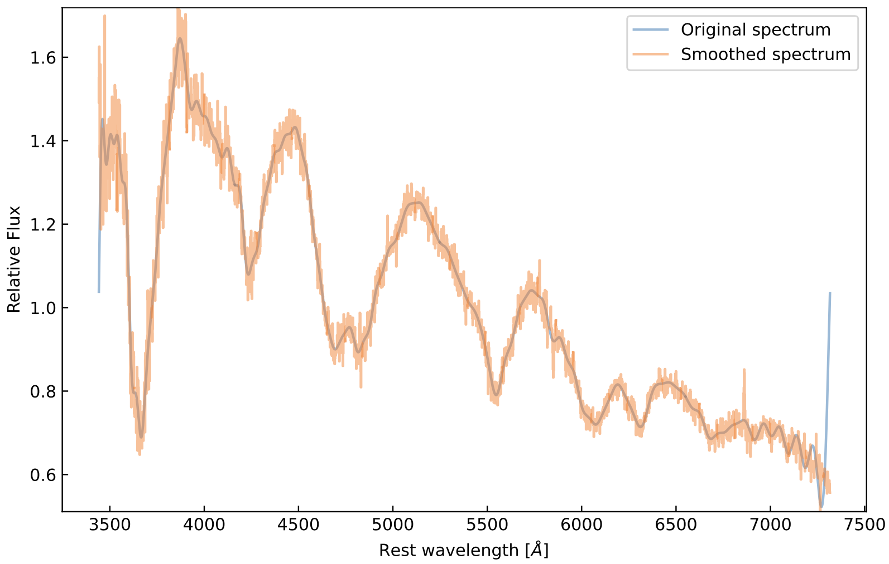
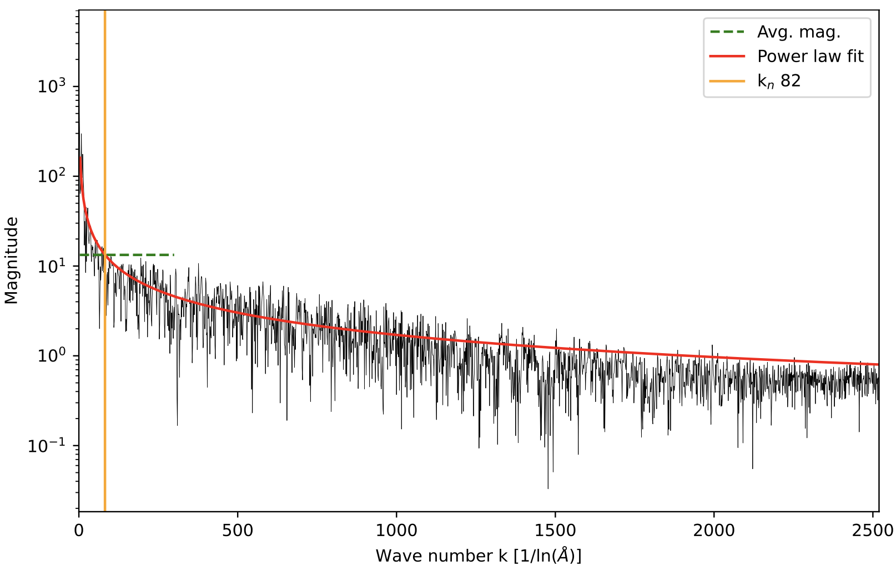

.. pyspecdenoise documentation master file, created by
   sphinx-quickstart on Thu Dec  5 20:36:27 2024.
   You can adapt this file completely to your liking, but it should at least
   contain the root `toctree` directive.

pyspecdenoise documentation
===========================

.. |GitHub Release| image:: https://img.shields.io/github/v/release/GabrielF98/pyspecdenoise?color=teal
   :alt: GitHub Release

.. |Publish with PyPI| image:: https://github.com/GabrielF98/fouriersmooth/actions/workflows/python-publish.yml/badge.svg
   :target: https://github.com/GabrielF98/fouriersmooth/actions/workflows/python-publish.yml
   :alt: Publish with PyPI

|GitHub Release| |Publish with PyPI|

Python library for removing noise from supernova spectra using a Fourier method. Implemented by Gabriel Finneran at University College Dublin, Ireland. 

Here is an example showing the input and result for a spectrum of SN2004gq (taken from `WISeREP <https://www.wiserep.org/object/8340>`_). 

A full description of the tool is given here. Further information may be found in `Finneran et al. (2024) <https://arxiv.org/abs/2411.12574>`_ (see below for how details on how to cite this work!).

This algorithm is based on the procedure presented in `Liu et al. (2016) <https://ui.adsabs.harvard.edu/abs/2016ApJ...827...90L/abstract>`_ (see their Appendix B). 
This is the first publicly available implementation of this algorithm written in Python.
An `IDL version of this code <https://github.com/metal-sn/SESNspectraLib/blob/master/SNspecFFTsmooth.pro>`_ is available from the original developers. 

This package can be installed from `PyPI <https://pypi.org/project/pyspecdenoise/>`_ using pip:

.. code-block:: bash

    pip install pyspecdenoise

The source code can be found on `GitHub <https://github.com/GabrielF98/fouriersmooth>`_. 
Issues can be logged `here <https://github.com/GabrielF98/fouriersmooth/issues>`_.

You can also contact me at `by email <mailto:gabfin15@gmail.com>`_.

Basic description
-----------------
Rebin the spectrum on a log-wavelength axis.

Resample spectrum into equal-width bins. Uses the smallest dispersion as the bin width.

Take the FFT of the flux. 

Define the range of wavenumbers/velocities for spectral features (see notes), the FFT indices are determined using k_low and k_high. 

Fit the magnitude (M) spectrum with a power law between k_low and k_high. 

Compute MEAN(M). 

k_noise is the point of intersection between the power law fit an MEAN(M). 

Set M = 0 for k>k_noise. 

Invert FFT. 

Resample spectrum to the original linear grid. 

Here is an example image showing the procedure used to determine k_noise (using the same spectrum of SN2004gq from WISeREP)

**Notes:**

k is related to the velocity of spectral features in the SN spectrum by k = c/v.

k can be chosen to exclude high and low velocity features that are likely not due to the SN.

The default values of k are k=300 (3000 km/s) and k=3 (100000 km/s) (Liu et al. 2016). 

How to cite this code in your work
----------------------------------
If you use emlineclipper in your work, please consider citing `Finneran et al. (2024) <https://arxiv.org/abs/2411.12574>`_ (see below for bibtex). I would also appreciate if you could add an acknowledgement such as:

.. code-block:: latex

   To remove noise from supernova spectra, 
   this work has made use of \texttt{pyspecdenoise}, 
   implemented by Gabriel Finneran and available at: 
   \url{https://github.com/GabrielF98/fouriersmooth}.
   
.. code-block:: bibtex

   @ARTICLE{2024arXiv241112574F,
         author = {{Finneran}, Gabriel and {Martin-Carrillo}, Antonio},
         title = "{Measuring the expansion velocities of broad-line Ic supernovae: An investigation of neglected sources of error in two popular methods}",
         journal = {arXiv e-prints},
      keywords = {Astrophysics - High Energy Astrophysical Phenomena},
            year = 2024,
         month = nov,
            eid = {arXiv:2411.12574},
         pages = {arXiv:2411.12574},
            doi = {10.48550/arXiv.2411.12574},
   archivePrefix = {arXiv},
         eprint = {2411.12574},
   primaryClass = {astro-ph.HE},
         adsurl = {https://ui.adsabs.harvard.edu/abs/2024arXiv241112574F},
         adsnote = {Provided by the SAO/NASA Astrophysics Data System}
      }

.. toctree::
   :maxdepth: 2
   :caption: Contents:
   
   example
   api
